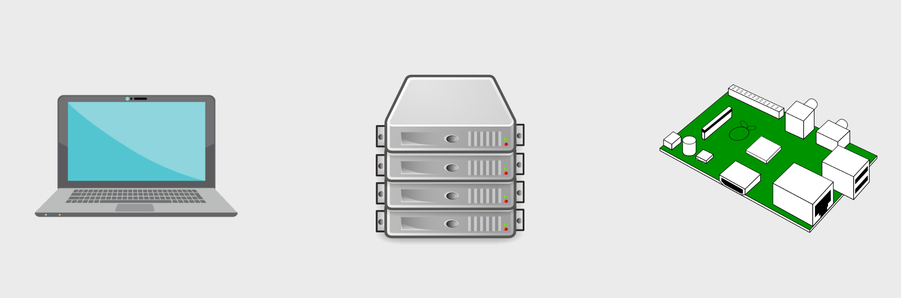
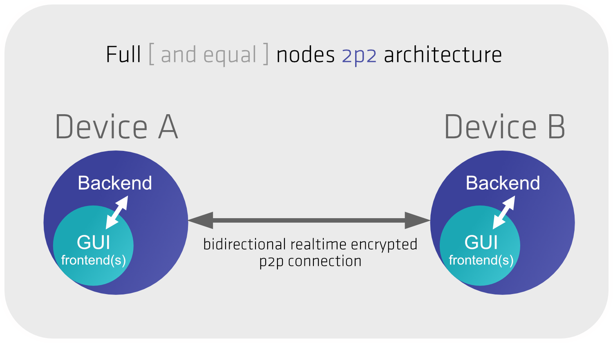
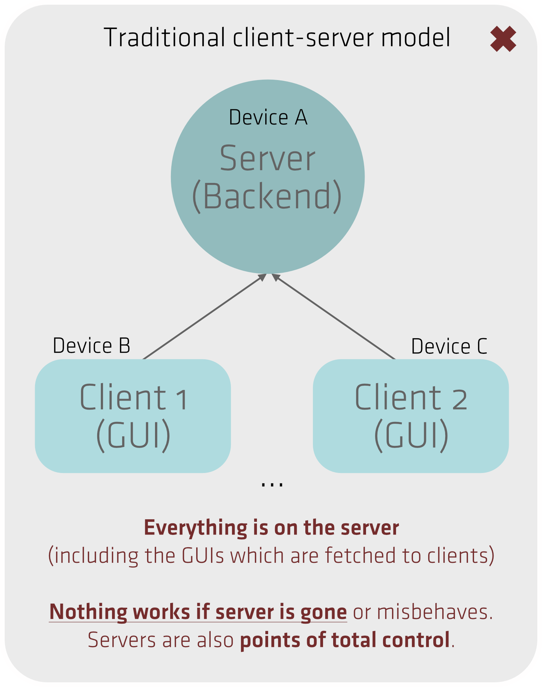

💡 [See the presentations](https://zetaseek.com/?mode=1&place=2f686f6d652f7a6574612f46696c65732f444d542d53595354454d2f50726573656e746174696f6e73) about the purpose of this Engine.

## Why is DMT ENGINE architecture special?

- Each device has the full backend and the entire frontend — this means it can work in an isolated offline mode (among other great benefits).

- The same process (DMT ENGINE + USER config + in-memory STATE) runs on all types of devices as seen in the picture on top.

**What is the traditional client-server architecture?**

Server runs in one place and all other devices connect to it to fetch the frontend (HTML, JS, CSS) and then communicate with the server:

**What are the disadvantages of "full node" architecture (DMT ENGINE)**

Special care has to be made by developers of the software so that all nodes can talk to each other without crashing or showing inconsistent behaviour even if they are at different versions.

**Auto-updates** and never ever forced and so we have to make sure that any version is compatible with any other version. It is however encouraged for all nodes to update frequently (especially in early fast-progress phase cca. 2020 to 2025) so that **their owners** can benefit from the full functionality.

**What are other advantages of full node architecture?**

Once you have the code on some of your devices, that's it, it always works and core functionality cannot break if some remote service fails. Data coming from other nodes (from you or your friends) which may not be available is just omitted in the GUIs. You also always see to which other nodes you currently have a live working encrypted direct connection.

## Learn more

- [DMT ENGINE 1.2 Getting Started Manual](https://docs.uniqpath/dmt)
- Join one of our [Friday meetups](https://dmt-system.com/)
- Ask questions in [uniqpath Discord channels](https://discord.gg/wBpKWepJra)

## Context

Presentations (slides) about our design principles and technology:

- Technical overview presentations about [DMT ENGINE and Connectome](https://zetaseek.com/?place=2f686f6d652f7a6574612f46696c65732f444d542d53595354454d2f50726573656e746174696f6e73).
- General trends in [Post-Social Networking](https://zetaseek.com/?mode=1&q=post%20social%20media) — clean and well done presentation by an independent 3rd party [research agency](https://co-matter.com/). We are very active in this area. Small group, regular meetings, excellent results. Some other people call this new movement a [Social+](https://a16z.com/social-strikes-back) category.

----

**Visit the DMT Online Events Coordination Website →** [dmt-system.com](https://dmt-system.com) 💡🚀🎸
