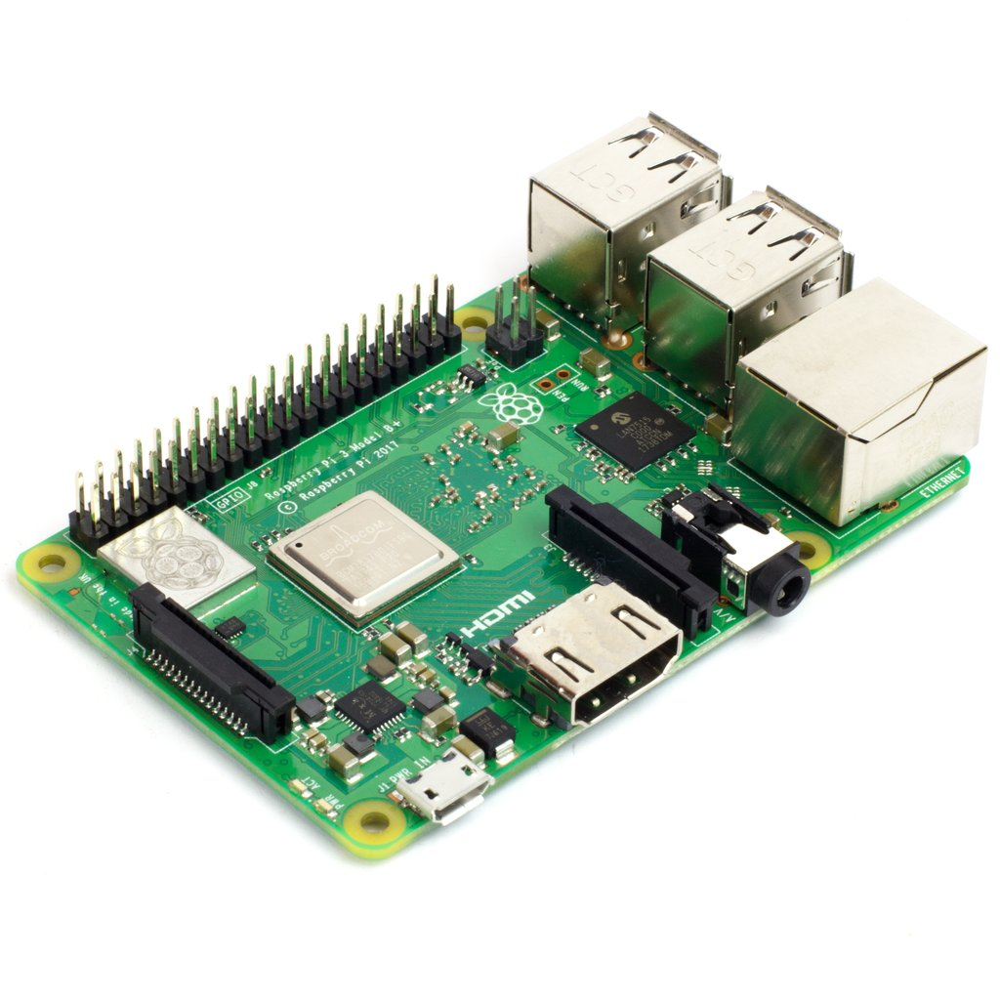
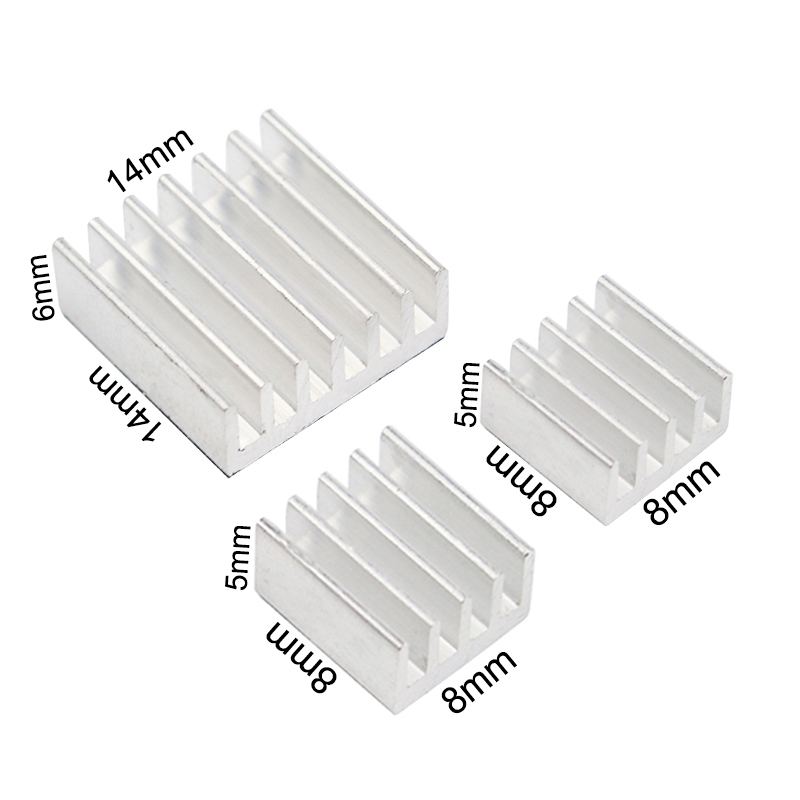
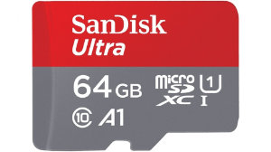
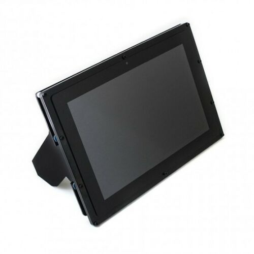
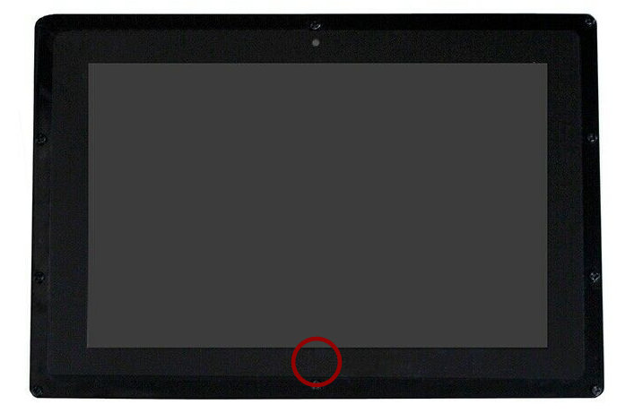
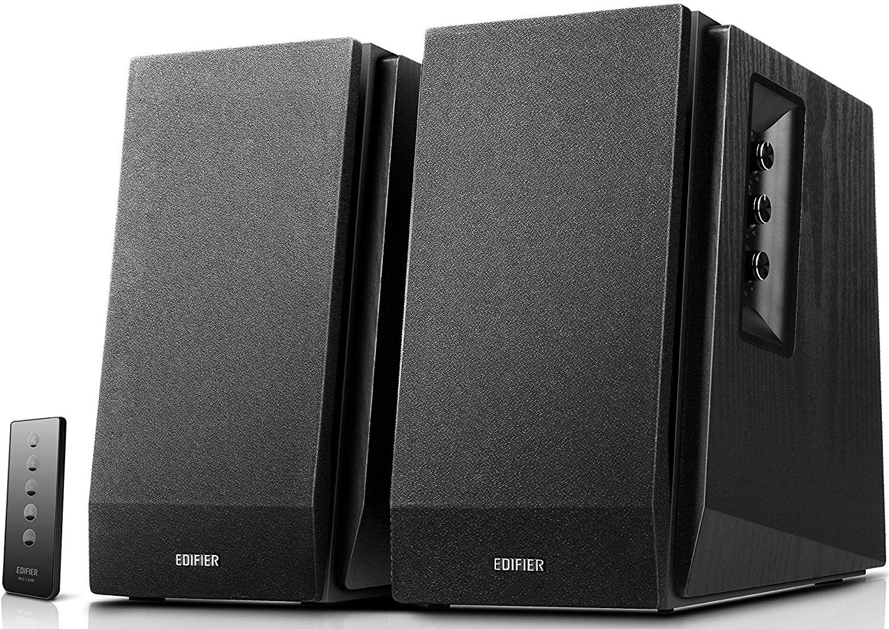
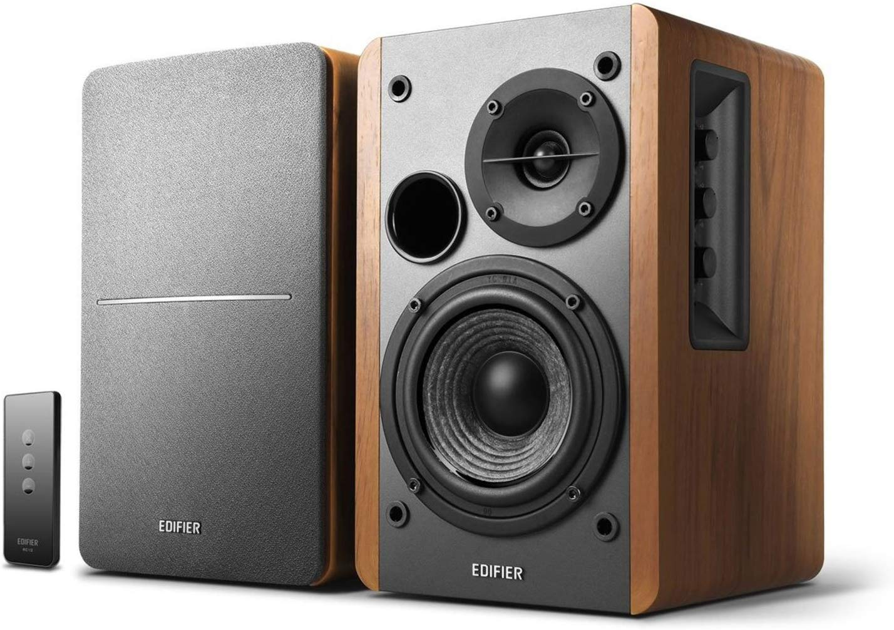
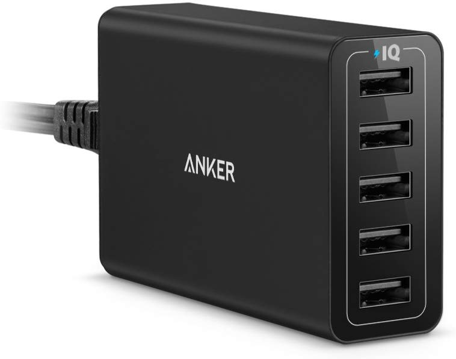
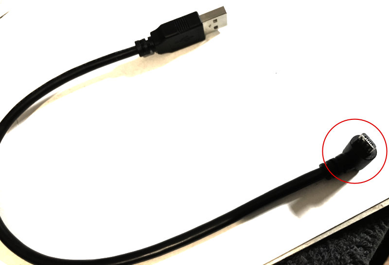
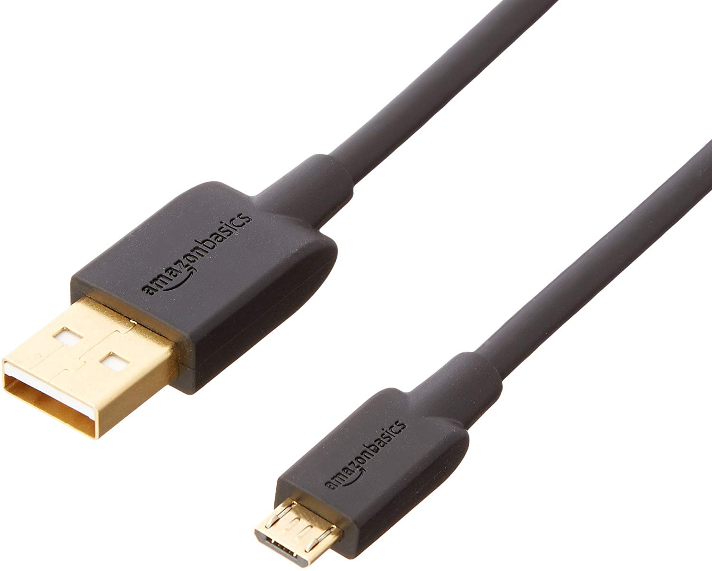

# DMT TABLET ingredients list

At the moment our software with its broader context is actually tested on <a href="https://www.raspberrypi.org/products/raspberry-pi-3-model-b-plus/">RaspberryPi 3B+</a>. If you are not a developer or even a very "technical person", you can still get a few RPi computers (preferably at least one with a 10.1" Waveshare IPS touchscreen) and ask someone "more technical" to follow instructions and make you a nice home setup. Just like we did it in the old days when desktop computing was just getting started. We used to ask smart kids to help us and later we saw what was the point.

## Raspberry Pi 3B+

find your local reseller (preferred) or order from amazon/ebay

**SETUP GUIDE**: [rpi_guide.pdf](https://github.com/uniqpath/info/blob/master/assets/pdf/rpi_guide.pdf)

⚠️ We will also soon provide pre-made **DMT OS** image which is ready for flashing onto the SD card so that there is no need to go through manual setup as described in rpi_guide.pdf. We will always maintain this guide for completeness sake though, it is important! While you wait for the official image and if you really want to understand how this works, indeed just follow the steps described and you will have a working system. You can then create your own image from the card for much easier flashing onto your other Raspberries. First one is the hardest! :) ... but it's worth it! You learn a lot and it does not take a lot of time. Steps are clearly described and well tested.

## Heatsinks (with 3M adhesive included)

https://www.aliexpress.com/item/1990031613.html?spm=a2g0s.9042311.0.0.27424c4dM91cQn

These are not strictly neccessary but you will find that your Raspberry devices generally perform with less glitches (esp. in summer). Just put one on each Raspberry (on the processor - big silver coated chip).

## SD Cards

Get **SanDisk** storage cards (tried brand, don't get no-name cheap cards!) to flash for usage in Raspberry Pi.  64 GB are great (and cheap nowadays!) for general use and maybe also get one 200 GB card for more flexibility in you system setup (to use as a cheap media server for your network).

https://www.amazon.com/SanDisk-Ultra-Class-Memory-SDSDUNC-032G-GN6IN/dp/B0143IIP4W?th=1

## Touch panel / screen

You can have many of these and all of them can control every aspect of your smart home / media system!

https://www.waveshare.com/10.1inch-hdmi-lcd-b-with-case.htm

Good option to buy from EU:
https://www.ebay.de/itm/Waveshare-HDMI-10-1-IPS-Display-1280x800-kapazitiv-Touchscreen-LCD-Raspberry-Pi/112430512432

You may want one of these at first and then a few more. Raspberry Pi devices used for powering speakers don't need a screen.

If you connect one of Raspberries to your TV directly, obviously that one also doesn't need a touch screen... while the one next to your TV does. You use this Raspberry to control what is playing on TV, on your living-room speaker etc.

Quick note: this display is very good and we tested many others to finally find a suitable option. There is one "hidden trick" that can be frustrating if you don't know it, namely this screen has a bit hidden touch control bottom down which sets brightness and even blanks the screen. Control is here:

So if your display suddenly goes dark or blank, then you touched this by accident and you have to retouch it. It's really not a big problem and is even useful but you have to know about it. We spent a few months investigating this "undocumented" feature and we thought something in video drivers was causing it. Doooh.

## Quality "non-smart" speakers

**dmt-system** makes them smart but not too smart! You don't want your smart speakers one day controlling you instead of you controlling them ;)

These are very good:

https://www.amazon.de/dp/B01N7QFBUU/ref=sr_1_3?keywords=edifier&qid=1574152738&sr=8-3&th=1

Also great (maybe even preferred choice because of price and a little bit smaller form-factor):

https://www.amazon.de/dp/B00GBN50SC/ref=sr_1_4?keywords=edifier&qid=1574152738&sr=8-4

You can also use any other quality speakers with amplifier built-in. You can of course build your own, you would need: housing, amplifier, power circuit, speaker membranes (this is a story for some other time ;)

You don't need bluetooth! Music in home does not like to travel over bluetooth protocol.

## HDMI CABLE

https://www.aliexpress.com/item/SAMZHE-hdmi-cable-soft-Slim-hdmi-to-hdmi-2-0-4K-UHD-3D-0-5M-1M/32813448519.html
Choose: <=0.5m

This goes from RaspberryPi to your touch screen HDMI port.

Get one longer HDMI cable as well in case you'll connect one of your Raspberries to your TV screen to watch movies and clips there. Sound will also travel through HDMI cable to your TV so you don't need separate speakers for this use case and hopefully your TV has great built-in speakers.

## ANKER 5-port USB charger
(or at least 2-port charger with 2A outputs)

https://www.amazon.de/gp/product/B00VUGOSWY

## 2x ANGLED USB CABLE

https://www.aliexpress.com/item/Up-Down-Left-Right-Angled-90-Degree-USB-Micro-USB-Male-to-USB-male-Data-Charge/32901092351.html

Up angled usb
0.3m UP angled

You need two of these, one from the screen usb port for touch to raspberry USB port.
And another (perhaps longer, say 0.5 or 1m) from screen power port to (anker) usb charger.

You could also use regular micro usb cables in place of these with angled connectors but they will stick out of the touch screen much more visibly (and you can have problems mounting the screen in your wall for example).

## 1x micro usb cable for charging

This cable goes from (anker) usb charger to Raspberry Pi.

Perhaps find them in your local store or order online.

Make sure they are quality cables  (by ordering from a respected store, otherwise you cannot really know).
In case of low quality power cables you will have issues with powering your devices and they will be flaky (you know when this is happening because a small "lightning icon" appears on the screen)!

👽 **Keep up Buidling the Future !**

